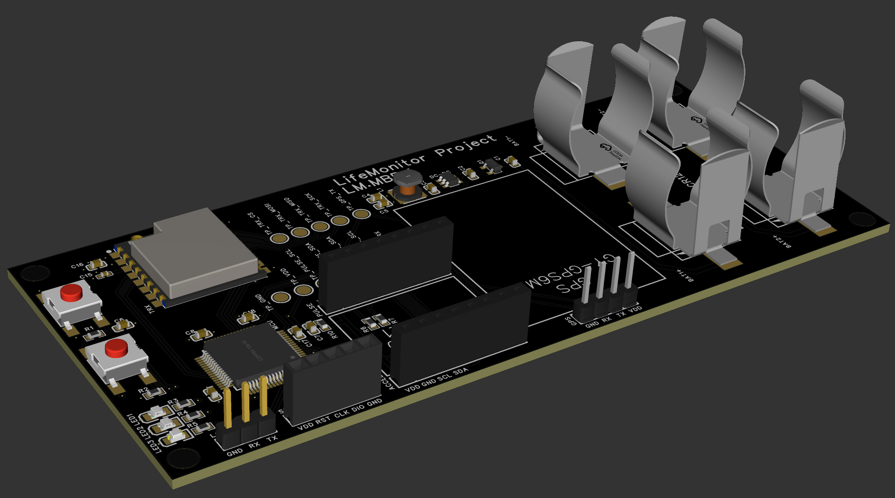

```
██      ██ ███████ ███████ ███    ███  ██████  ███    ██ ██ ████████  ██████  ██████  
██      ██ ██      ██      ████  ████ ██    ██ ████   ██ ██    ██    ██    ██ ██   ██ 
██      ██ █████   █████   ██ ████ ██ ██    ██ ██ ██  ██ ██    ██    ██    ██ ██████  
██      ██ ██      ██      ██  ██  ██ ██    ██ ██  ██ ██ ██    ██    ██    ██ ██   ██ 
███████ ██ ██      ███████ ██      ██  ██████  ██   ████ ██    ██     ██████  ██   ██ 
```

### About

Project that monitors vital signs of military personnel on battlefield by keeping track of pulse and sudden movements to speed up first aid response.



### Structure
Project consists of 2 parts - devices & stations.  
Device is a battery powered board based on `STM32L073`.  
Device is mounted on the arm & monitors 3 metrics:  
 - Pulse using `MAX30100`  
 - Acceleration using `MPU6050`  
 - GPS location using `NEO6M`  
Data is then transmitted using a simple proprietary radio protocol based on LoRa modulation with RA-02 module (sx1278).  
Device firmware is located in the root directory of the repository.  
Station is a RaspberryPi that uses LoRa to communicate with devices and save all the metrics.  
Station application is located in `station` directory.  

### How to build device firmware
#### Prerequisites
 - CMake (at least 3.27)  
 - ArmGCC toolchain (`arm-none-eabi-gcc`)
  
#### Steps  
 - `git submodule update --init --recursive`
 - `cmake -B build -S . -G "Unix Makefiles" --preset "LifeMonitor LM.MBR.1 Debug"`  
 - `cmake --build build --target LifeMonitor -j$(nproc)`
